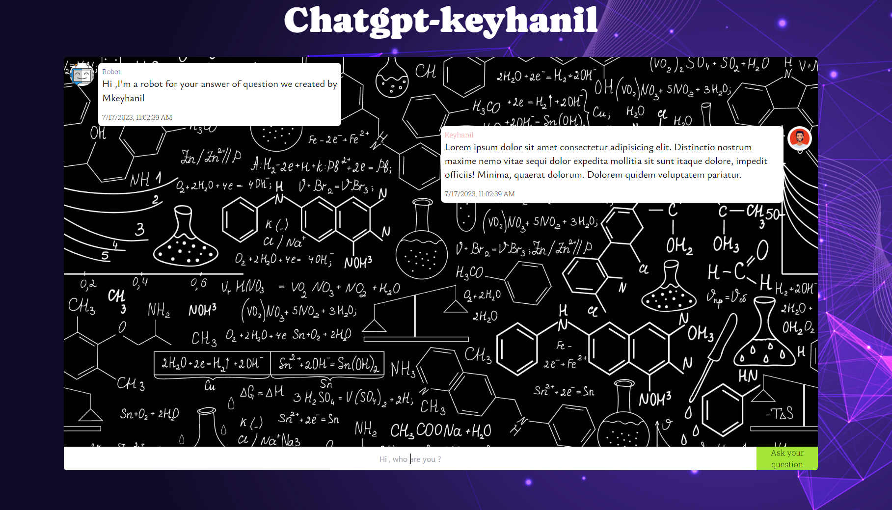

# chatgpt-keyhanil

<h2>What's on Chatgpt-keyhanil</h2>
<h3>Could ask anything there have an spacial wab without waiting for answer, developed by Chatgpt-3.5</h3>

<h2>What technology we did use ?</h2> 
<h3>
    <ul>
    <li>ReactJs</li>
    <li>Tailwind</li>
    </ul>
</h3>

<h3>Looking around Chatgpt-keyhanil</h3>

